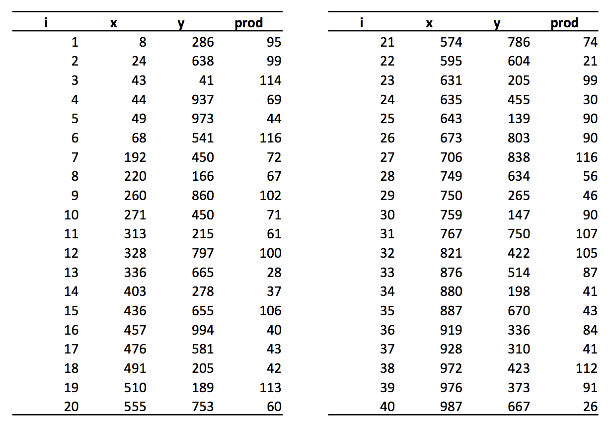

# Route Optimisation Algorithm

This project is a simple system that calculates distance of some given points for a specific quantity to be transported from suppliers to the Distribution Center - DC.

## Parameters Used

The table below has the data used to perform the operations considered for this purposed project. Each line correspond to a supplier, x and y coordinates of its localisation that is used to measure distances, and Prod is the quantity available for each one:

<!--  -->

Some parameters more were used as follows:

* Distribution Center coordinates: (500, 500)
* Transportation cost per Km: 0.3€
* Truck’s capacity: 200 units
* Truck daily cost: 50€

## System Structure:

It is composed of 5 classes file that intents to give some organisation and more consistency while managing data, as described below:

> SupplierProcessStarter.java: This is the Main class, so all data processing is performed here, which means it is where all starts. Below is listed its substantial methods:

* Main: It is responsible to trigger all needed processes made by all other methods listed below.

* initVaribles: Starts all global variables that the class needs to work.

* dataFeed: Load all preload data the system needs to process, except the transportation quantity that the user needs to enter on the first screen.

* orderingList: This method is called by dataFeed to order registers by distance from DC, allowing that reading can be done in sequence from shortest to the longest distance.

* calcTruckDemand: Generate a list of trucks based on the ratio of demand of products to be collected over trucks capacity that is 200 units.

* checkFreeTruck: This method is called by dataFeed to order registers by distance from DC, allowing that reading can be done in sequence from shortest to the longest distance.

* cenario1NextDcDistance: This method designs all calculations related to distance between suppliers from DC.

* cenario2NextNeighbor: Does the same as the prior method, but uses the next neighbour shorter distance to decide where to go as following steps

* calcDistance: Used to make basic calculation between 2 coordinates, returning the distance.

* nextDistance: This method gets the shortest distance calculation relative to DC, that is used essentially by cenario1NextDcDistance method.

* nextNeighbor: Similar to the previous method, it also gets the shortest distance, but now from the current position of the truck, which it is named next neighbour.

* calcListOrders: runs at the end of scenarios to get all partial values (distance and values) and sum them to give the results.

* melhorRota: verify the best solution calculated by the above method, comparing the results of all scenarios and print it.

> DataSupplierClass.java: created to encapsulate the core data that is preloaded, turning organised, consistent and safer to manage in all operations.

When the second class constructor is instantiated, it besides loading data in respective variables also execute the method to calculate x and y distance from DC coordinates and set the distance in a variable too.

> TruckClass.java: format object to save trucks informations that will be used in both scenarios to be part of datas from several arrays list.

>
## Testing Scenarios

It was considered at first and simple version of this project 2 scenarios, Next Neighbour and Shorter Distance relative to the DC. Both are similar while cost and distance calculations, standing the difference within the detail of choosing the reference to take as the base to select the next point.

In a future version it is intended to add a third scenario which consider the ratio between units (quantity) to be collected and distance, taking the best ratio as parameter of decision to choose next point, expecting to have the best cost x benefit.

## Instructions to run Route Optimisation Algorithm System:

It was developed using Java 11 and IntelliJ IDE, so everything that is needed to do is Run it. But if it is not possible to reproduce the same environment, there is an option to run it in command line, as described below, special attention just for the Java version, because it would be necessary to compile all, just in case using another version.

* In case of existing the need to compile it, goes to the project folder and type this command in Terminal (or whatever your system allows run it by command line, considering Java is already installed and running):

`javac -d out/ src/pt/ipp/SupplierAlg/*`

* After compiling, goes to the folder out/ and there run this command:

`java pt/ipp/SupplierAlg.SupplierProcessStarter`

Requirements
------------

Getting it working, all you need is listed bellow:

* Java SE Development Kit 11
